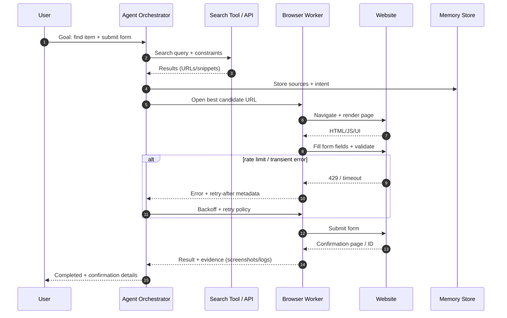
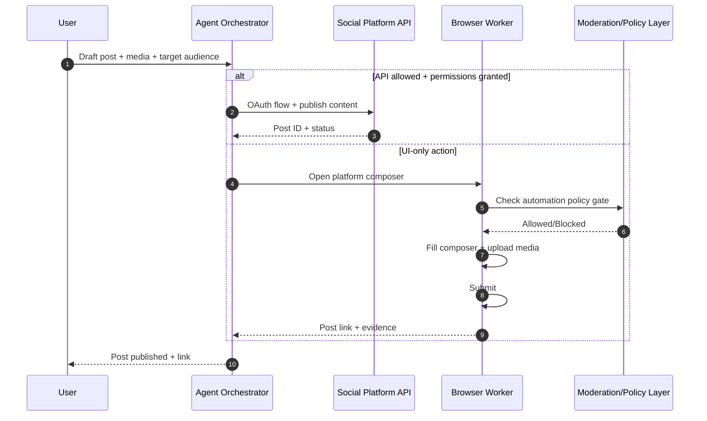
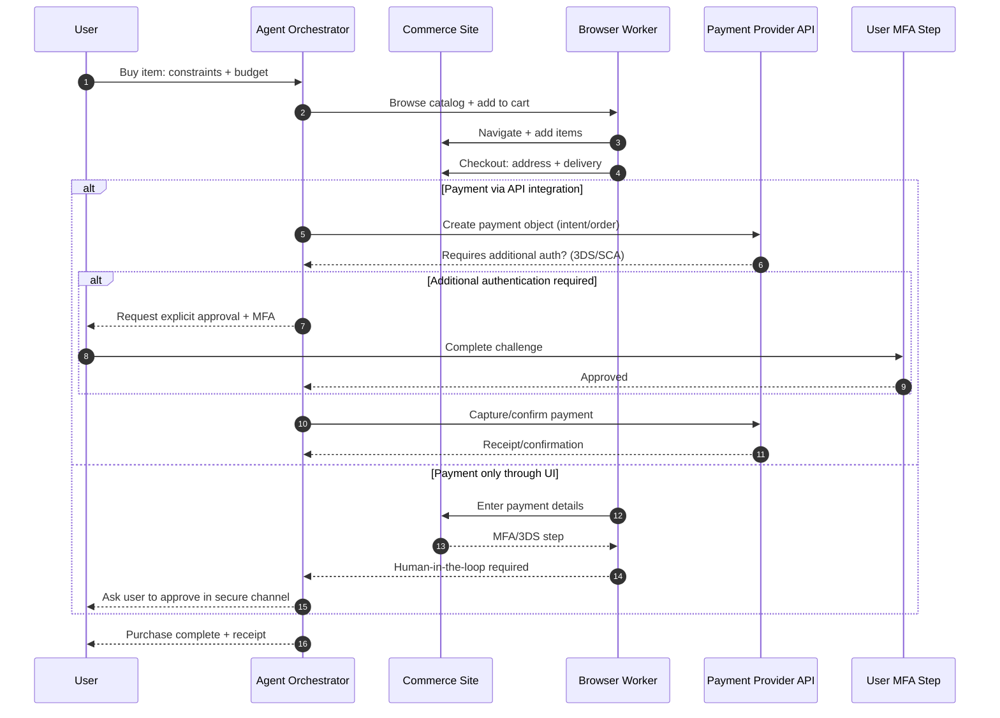
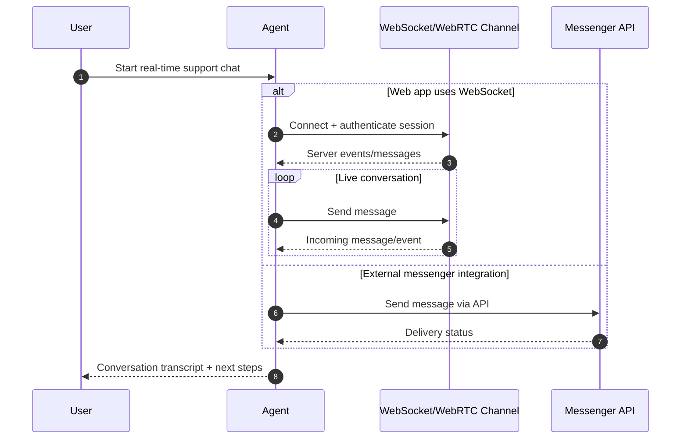

# Требования к AI‑агенту, способному соперничать с человеком в Интернете

## Резюме для руководителей

Чтобы AI‑агент «на уровне человека» мог работать в Интернете (а не только отвечать на вопросы), ему нужны не столько «умные ответы», сколько полнофункциональная цифровая дееспособность: способность **воспринимать веб‑среду**, **входить в системы как пользователь**, **действовать в рамках правил**, **безопасно управлять идентичностями и данными**, а также **надежно завершать длинные цепочки задач** (поиск → сравнение → заполнение форм → оплата → подтверждения → коммуникации). Это вывод опирается на то, что сами стандарты и протоколы веба разделяют уровни (HTTP, cookies, WebSocket/WebRTC, OAuth/WebAuthn и т. п.), а крупные платформы отдельно регулируют автоматизацию и доступ к данным через API и условия использования. citeturn8search0turn5search2turn0search3turn8search1turn1search7turn30search1turn30search2

Ключевой практический тезис: **«человекоподобность» агента в Интернете — это архитектурная и продуктовая задача**, а не только модельная. На практике требуется сочетание:  
- **инструментального слоя** (браузерная автоматизация, сетевые клиенты, мультимодальные конвейеры), citeturn0search0turn0search1turn26search0turn9search2turn0search3turn17search3turn17search1  
- **слоя идентичности/комплаенса** (согласия, хранение секретов, управление аккаунтами, соблюдение GDPR/CCPA и ToS), citeturn29search2turn1search9turn6view0turn13search8turn10search5turn30search6  
- **слоя надежности/безопасности** (изоляция, минимизация данных, аудит, восстановление после ошибок, rate limiting), citeturn4search0turn3search1turn5search3turn3search3turn15search12  
- **слоя памяти и обучения** (долгосрочная память, retrieval‑потоки, оценка качества и безопасное дообучение), при этом существующие бенчмарки показывают, что «длинный горизонт» веб‑задач остается сложным даже для сильных моделей. citeturn7search1turn7search0turn7search15  

Непроясненные параметры (критично для проектирования) — **не указаны** в запросе и должны фиксироваться как требования перед началом инженерии: целевые сайты/домены, допустимые действия (read‑only vs транзакции), юрисдикции обработки данных, требования к приватности (локально/облако), целевые задержки/стоимость, допустимость прокси/VPN/Tor, режим «без обхода защит», доля задач с «human‑in‑the‑loop», а также требования к логированию и хранению артефактов (скриншоты/видео/трейсы). citeturn3search3turn4search0turn13search8turn10search5  

## Какие человеческие интернет‑возможности нужно эмулировать

Человек в Интернете действует как «универсальный оператор», который объединяет восприятие, цели, контекст и социальные нормы. Для агента это раскладывается на набор воспроизводимых «компетенций» и метрик качества.

**Навигация и просмотр (browsing).** Человек умеет открывать страницы, переходить по ссылкам, ориентироваться в сложных SPA‑интерфейсах, работать с вкладками/окнами, загружать файлы, обрабатывать ошибки, подтверждения и всплывающие диалоги. На уровне стандартов это означает: корректная работа с HTTP и состоянием (cookies), с DOM‑структурой и JS‑исполнением, а также поддержка «пользовательских событий» (клики, ввод, drag‑and‑drop). citeturn8search0turn5search2turn9search2turn9search3

**Поиск (search).** Человек комбинирует поисковые запросы, уточняет формулировки, фильтрует выдачу и оценивает доверие к источнику. Для агента это обычно требует либо доступа к поисковому API/инструменту, либо надежной работы через браузер, плюс последующей верификации и извлечения фактов. citeturn7search16turn0search1turn26search0

**Социальное взаимодействие (social interaction).** Это не просто «постить текст», а соблюдать нормы платформы: оформление, ссылки/медиа, частота публикаций, ответы/упоминания, модерационные ограничения и правила автоматизации. Крупные платформы прямо регулируют автоматизированную активность и последствия нарушений. citeturn30search2turn30search6turn13search8turn10search9

**Транзакции (transactions).** Человек проходит многошаговые платежные сценарии (корзина → адрес → оплата → 3‑D Secure/допподтверждения → чек). Платежные API отражают это жизненными циклами объектов и «дополнительной аутентификацией при необходимости». citeturn10search3turn10search7turn13search16turn13search5

**Создание контента (content creation).** Включает генерацию текста, изображений/видео, форматирование, публикацию в CMS/соцсетях, а также соблюдение политики платформ и авторских прав. На техническом уровне — управление формами, загрузка файлов, предпросмотр и обработка редакторов. citeturn0search1turn26search0turn13search8

**Потребление мультимедиа (multimedia consumption).** Человек смотрит видео/слушает аудио, извлекает смысл и может пересказать/процитировать. Для агента это часто требует мультимодального ввода/вывода: speech‑to‑text, OCR для субтитров/кадров, text‑to‑speech для обратной связи. citeturn17search1turn17search3turn17search2

**Коммуникации в реальном времени (real-time communication).** Чаты и звонки — это либо протоколы вроде WebSocket и WebRTC в браузере, либо нативные API мессенджеров. citeturn0search3turn9search1turn11search0turn11search1

**Персонализация и моделирование пользователя (personalization).** Человек ожидает, что помощник «помнит предпочтения», но при этом не нарушает приватность. В правовом контексте «профилирование» и автоматизированная обработка персональных данных являются отдельной темой регулирования и практик минимизации/ограничения целей. citeturn29search2turn32search12turn29search8

**Управление приватностью (privacy management).** Это управление cookies/разрешениями, предпочтениями «не продавать/не делиться данными», и общее следование принципам приватности. В веб‑стандартах есть как принципы приватности, так и конкретный сигнал предпочтения (GPC), передаваемый через HTTP и DOM. citeturn32search1turn3search6turn29search1

**Мультиаккаунты и долгосрочная память (multi-account, long-term memory).** Человек обычно имеет множество аккаунтов (личный/рабочий, разные роли), переключается между ними и «держит контекст» месяцами. Для агента это означает: изолированные профили/контексты браузера, хранилища cookies/localStorage/IndexedDB, безопасные секреты, плюс долговременная память задач/фактов (включая источники). citeturn16search0turn30search0turn5search2turn15search0

**Обучение (learning).** Человек улучшает навыки на новых сайтах, переносит опыт и не «ломается» от изменений UI. Исследовательские среды показывают, что универсальные веб‑агенты пока далеки от человеческой устойчивости на длинных задачах, и это нужно учитывать как «продуктовый риск». citeturn7search1turn7search0turn7search15

## Технические инструменты и интерфейсы, необходимые агенту

Возможности из предыдущего раздела реализуются через «инструментальный слой». Ниже — практичное разбиение по интерфейсам (браузер/сеть/медиа/интеграции) и тому, **почему** каждый класс инструментов нужен.

**Браузеры, WebDriver и автоматизация.** Стандарт entity["organization","W3C","web standards body"] WebDriver описывает «удаленный контроль пользовательского агента» (браузера) через нейтральный протокол. citeturn0search0 Реализации обычно доступны через фреймворки вроде entity["organization","Selenium","browser automation project"] WebDriver, который позиционируется как способ управлять браузером «нативно, как пользователь». citeturn0search2turn31search6 Для современных динамических веб‑приложений важны и новые двунаправленные протоколы (WebDriver BiDi), которые используют WebSocket‑транспорт для событий в реальном времени. citeturn5search1turn0search3turn5search13

**Playwright/Headless/DOM/JS execution.** entity["organization","Microsoft","software company"] entity["organization","Playwright","browser automation framework"] предоставляет единый API для автоматизации Chromium/Firefox/WebKit и поддержку изолированных «browser contexts» как независимых сессий. citeturn0search1turn16search0turn19search23 Для масштабирования и CI важно уметь запускать браузер в headless‑режиме (например, Chrome Headless запускается без видимого UI и рассчитан на unattended‑сценарии). citeturn26search0

**HTTP‑клиенты, Fetch‑модель и протоколы реального времени.** Многие действия быстрее и дешевле делать без «полного браузера», используя HTTP‑клиент (requests/axios/Go http) — но при условии, что сайт допускает API‑доступ и не требует сложного JS‑рендеринга. Базовая семантика HTTP формализована в RFC 9110. citeturn8search0 Модель веб‑запросов в браузерах описывает Fetch Standard, что полезно при «приближении» поведения агента к реальному браузеру. citeturn9search2 Для интерактивности в реальном времени ключевой протокол — WebSocket (RFC 6455). citeturn0search3

**Состояние, cookies и управление сессиями.** Сессии веба почти всегда опираются на cookies (RFC 6265) и/или web‑storage (localStorage, IndexedDB). citeturn5search2 В Playwright предусмотрено повторное использование «authenticated state» (cookies/local storage/IndexedDB) и управление независимыми сессиями через browser contexts. citeturn30search0turn16search0turn16search1 Это критично для «мультиаккаунта» и ролевого доступа.

**Браузерные расширения.** Для части задач удобнее расширение (перехват/модификация запросов, ассистирование пользователю). Платформенные ограничения расширений меняются (например, переход на Manifest V3). citeturn13search2turn13search10 Агенту может потребоваться «плагинная» архитектура для расширения поведения браузера без вмешательства в сам движок.

**Мобильные API и automation на устройствах.** Чтобы повторять человеческий сценарий «с телефона», требуется мобильная автоматизация. entity["organization","Appium","mobile automation framework"] позиционируется как кроссплатформенная UI‑автоматизация (iOS/Android/desktop и др.) и обычно используется, когда веб‑версии недостаточно или требуется нативный поток (банковские приложения, мессенджеры). citeturn12search7turn12search15turn12search11

**Email/IM API и протоколы.** Для «почты как у человека» нужны SMTP (RFC 5321) для отправки и IMAP4rev2 (RFC 9051) для доступа к ящикам. citeturn8search3turn9search0 На практике часто используют API провайдеров: Gmail (users.messages.send) citeturn11search2 или Microsoft Graph (процесс send mail). citeturn11search11 Для мессенджеров — официальные API: Telegram Bot API citeturn11search0, Slack chat.postMessage citeturn11search1 и т. п.

**Социальные API.** Для соцсетей почти всегда предпочтительнее официальные API (и безопаснее с точки зрения ToS), чем скрейпинг UI. Примеры: Graph API у Meta. citeturn10search8turn13search4 Для entity["company","X","social media company"] действуют отдельные правила автоматизации и developer‑соглашения. citeturn10search5turn10search1turn10search9

**Платежные API.** У entity["company","Stripe","payments company"] PaymentIntent «ведет» оплату по жизненному циклу и может триггерить дополнительные шаги аутентификации. citeturn10search3turn10search7 У entity["company","PayPal","payments company"] REST API использует OAuth 2.0 и предоставляет авторизацию/захват/возвраты; также описан двухшаговый authorize‑and‑capture (например, «холд средств на 29 дней»). citeturn13search1turn13search5turn13search16

**OCR, speech‑to‑text, text‑to‑speech.** Для «человеческой» работы с изображениями (сканы документов, капчи как UI‑элемент, скриншоты, мемы, графики) нужен OCR: например, Tesseract (Apache 2.0) citeturn17search14turn17search0 или облачные OCR‑API (Google Cloud Vision OCR). citeturn17search3 Для речи — STT (например, Whisper как open‑source модель) citeturn17search1 и TTS (например, Coqui TTS). citeturn17search2

**Screen scraping, DOM parsing и извлечение структуры.** Даже при наличии DOM, агенту нужно надежно парсить структуру, понимать изменения UI и устойчиво извлекать поля/таблицы. Это опирается на DOM‑модель и браузерные события. citeturn9search3turn9search2

**CAPTCHA и антибот‑механизмы.** Важно различать:  
- *легитимные варианты* — вы владелец сайта или у вас есть разрешение, и вы интегрируете решения вроде Turnstile (позиционируется как «CAPTCHA‑альтернатива» и описан в документации Cloudflare) citeturn12search4turn12search12 или используете reCAPTCHA по правилам провайдера (есть квоты и режимы enterprise). citeturn12search1  
- *неприемлемые варианты* — обход защит и «победить капчу» без разрешения, что обычно нарушает ToS и может создавать правовые риски; для проектирования «агента уровня человека» это должно быть зафиксировано как **запрещенный режим** (если не указано иначе и нет разрешений). citeturn13search8turn10search5turn30search1

**Прокси/VPN/Tor и сетевые профили.** Эти инструменты бывают нужны для приватности, тестирования гео‑версий, корпоративных политик и защиты канала, но могут конфликтовать с правилами сервисов и триггерить антифрод. citeturn16search3turn3search6turn10search5 Для приватности и сопротивления fingerprinting entity["organization","Tor Project","nonprofit privacy org"] описывает защиты Tor Browser (изоляция и антифингерпринтинг‑механизмы). citeturn16search3turn31search5turn3search8 В то же время W3C публикует руководство по снижению fingerprinting‑рисков на уровне спецификаций (важно для «privacy management» агента). citeturn3search6

**Управление учетными данными и MFA.** Агенту нужен «credential manager / password vault» и работа с MFA. Для секретов инфраструктуры часто используют entity["company","HashiCorp","infrastructure software company"] Vault (управление секретами). citeturn14search1 Для пользовательских паролей — entity["company","Bitwarden","password manager"] (с описанной моделью лицензирования core‑компонентов). citeturn14search13turn14search2 По MFA: TOTP стандартизован в RFC 6238. citeturn8search2 Для «passwordless»/passkeys — WebAuthn (W3C). citeturn1search7turn1search14

**Планирование, оркестрация и надежность выполнения.** Человек «держит задачу в голове» неделями; агенту нужен надежный механизм длительных процессов, расписаний и повторов. В Kubernetes CronJob описывает периодический запуск задач. citeturn4search3 Для устойчивых бизнес‑процессов часто используют workflow‑оркестраторы, например entity["organization","Temporal","workflow orchestration platform"], который позиционирует «durable execution» и восстановление после сбоев. citeturn15search12turn15search6

**RAG/LLM‑интеграция, knowledge base и vector DB.** Долгосрочная память и поиск по накопленным артефактам обычно реализуются через retrieval‑конвейеры и векторные хранилища: pgvector для Postgres citeturn15search0, Weaviate citeturn15search1turn19search17, Milvus citeturn19search10turn19search18. В практических системах это соединяют с LLM‑инструментами (например, официальный web‑search tool‑подход в API). citeturn7search16

**Аналитика, мониторинг, логирование, observability, recovery.** Для промышленной эксплуатации требуется трассировка, корреляция логов/метрик и контроль PII. OpenTelemetry описывает спецификацию и принципы (включая ресурсы/контекст и корреляции). citeturn3search3turn3search15turn3search11 Для восстановления — backoff/rate limiting через 429 Too Many Requests и Retry‑After (RFC 6585), иначе агент превращается в «хрупкого бота». citeturn5search3

image_group{"layout":"carousel","aspect_ratio":"16:9","query":["W3C WebDriver protocol diagram","Playwright browser context architecture diagram","Chromium site isolation diagram sandbox renderer process","OpenTelemetry tracing diagram"]}

## Идентичность, согласие, жизненный цикл аккаунтов и комплаенс

Этот блок часто недооценивают: человеческие «входы» в сервисы и социальные действия регулируются сильнее, чем чистая навигация. У агента должны быть формализованы: **кто он**, **на каком основании действует**, **какие данные обрабатывает**, **как хранит**, **как прекращает доступ**.

**Аутентификация и авторизация.**  
- OAuth 2.0 — базовый стандарт получения ограниченного доступа к HTTP‑сервисам «от имени владельца ресурса» через явное одобрение. citeturn8search1  
- WebAuthn — стандарт сильной аутентификации с ключами/аттестацией и привязкой к origin и согласию пользователя. citeturn1search7  
- TOTP — распространенный второй фактор, стандартизованный (RFC 6238); агенту важно поддерживать **политику: когда допустимо автоматизировать MFA**, а когда это должно быть «только руками пользователя» (часто — только руками). citeturn8search2  

**Жизненный цикл аккаунта (account lifecycle).** Для «уровня человека» агент должен уметь: регистрироваться (если разрешено), проходить email/phone‑верификацию, восстанавливать пароль, управлять устройствами/сессиями, разлогиниваться, удалять/деактивировать аккаунт, экспортировать данные (если предусмотрено), а также корректно обрабатывать блокировки и проверки «подозрительной активности». Это не закрывается одним протоколом и требует сочетания email/IM каналов (SMTP/IMAP или provider API) и браузерной автоматизации. citeturn8search3turn9search0turn11search2turn0search1

**Согласие и защита данных в GDPR‑логике.** Европейская комиссия подчеркивает, что GDPR технологически нейтрален и охватывает автоматизированную обработку персональных данных. citeturn29search2turn29search5 В русскоязычных официальных материалах ЕС также фиксируется смысл GDPR как усиления гарантий приватности. citeturn5search12 На инженерном языке это означает: минимизация данных, ограничение целей, ограничение сроков хранения, целостность/конфиденциальность и подотчетность как «архитектурные требования», а не только юридический текст. citeturn32search12turn4search0turn3search2  
Если требуется русскоязычная «читабельная» версия текста, существуют переводы (не первоисточник), что может помочь продуктовым/юридическим командам, но в спорах и формальных проверках опираться нужно на официальные тексты и компетентные органы. citeturn5search0

**CCPA/CPRA‑логика.** Генпрокурор Калифорнии описывает CCPA как закон, дающий потребителям больший контроль над тем, какие персональные данные собираются и как используются. citeturn1search9 Сам текст закона фиксирует требования «уведомления при сборе», цели, а также пропорциональность сбора/удержания данных заявленным целям. citeturn6view0 Это превращается в требования к агенту: понятные уведомления пользователю, настройка retention, возможность отвечать на запросы субъектов данных (если агент действует как оператор/обработчик).

**Условия использования и риск блокировок.** Для веб‑агента «уровня человека» риск №1 — не технический, а контрактный: многие платформы запрещают автоматизированный сбор данных или доступ «автоматическими средствами» без разрешения. Например, в Terms of Service entity["company","Meta","social technology company"] прямо указано, что нельзя получать доступ или собирать данные автоматическими средствами без предварительного разрешения. citeturn13search8 Дополнительно Meta публикует политику Automated Data Collection, где подчеркивается, что программный доступ должен идти через Platform APIs, если нет письменного разрешения. citeturn30search1turn13search4  
Для X автоматизация «подчиняется правилам X и developer‑соглашениям», а нарушения ведут к санкциям приложений/аккаунтов. citeturn30search2turn30search18  
Вывод: архитектура должна поддерживать режим **API‑first + permissioned automation**, а также «красные линии» (что агент делать не должен). citeturn13search4turn10search5

**Персональные предпочтения приватности (privacy signals).** Стандарт Global Privacy Control описывает сигнал do‑not‑sell‑or‑share, передаваемый как HTTP‑заголовок и через Web API свойство. citeturn29search1 Для агента это означает: (1) уважать такие сигналы в собственном сборе данных, (2) уметь генерировать их по выбору пользователя, (3) фиксировать в audit trail, что «мы передавали/не передавали» сигнал.

## Безопасность и безопасность поведения агента

Веб‑агент, сопоставимый с человеком, фактически является «оператором» с доступом к аккаунтам, платежам и личным данным. Поэтому безопасность должна быть двойной: **security** (защита системы) и **safety** (защита пользователя и окружающих от непреднамеренных действий агента).

**Изоляция исполнения (sandboxing) и границы доверия.** Реальные браузеры опираются на изоляцию процессов и sandbox как ключевую границу безопасности; Chromium описывает Site Isolation как использование sandboxed renderer processes для разделения сайтов. citeturn3search1turn3search9 Для агента это напрямую превращается в требование: каждая «сессия»/«учетка»/«задача» — в отдельной песочнице, чтобы компрометация одного сайта/скрипта не давала доступ к секретам и другим аккаунтам.

**Контейнеризация и виртуализация.** NIST SP 800‑190 систематизирует угрозы контейнеров и рекомендации по их снижению. citeturn4search0turn4search4 Для более сильной изоляции уместны «sandboxed containers» вроде entity["organization","gVisor","sandboxed container runtime"] (позиционируется как дополнительный слой безопасности для контейнеров). citeturn4search5turn4search9 Для особо чувствительных операций (например, платежи, работа с админ‑панелями) — microVM подходы типа Firecracker (быстрый старт microVM и фокус на security/speed/efficiency). citeturn4search6turn4search10

**Принцип наименьших привилегий и минимизация данных.** На практике это означает: агент получает только те разрешения, которые нужны для конкретной операции, и хранит минимум PII/секретов. «Privacy principles» W3C и fingerprinting‑guidance дают рамку угроз приватности и виды смягчений, полезную как «security requirements» для продукта. citeturn3search2turn3search6А для GDPR‑логики технологическая нейтральность и 7 принципов обработки подталкивают к системному data governance (цели, минимизация, сроки). citeturn32search12turn29search2

**Управление секретами и MFA.** Хранение паролей, токенов OAuth, ключей API и банковских «секретов» не должно происходить в логах/промптах/трейсах. Для инфраструктурных секретов — Vault (secrets management). citeturn14search1 Для паролей пользователя — password vault (например, Bitwarden описывает лицензирование core и отдельных enterprise‑фич). citeturn14search13turn14search2 MFA по TOTP/WebAuthn должно быть встроено как «поток с явным согласием» (и часто — с обязательным human‑in‑the‑loop). citeturn8search2turn1search7

**Аудит‑трейлы, наблюдаемость и расследования.** Нужны: журналы действий (кто/когда/что нажал), сетевые трейсы и корреляция. OpenTelemetry прямо проектируется как vendor‑neutral спецификация сигналов (traces/metrics/logs) и корреляций. citeturn3search3turn3search7 Важно иметь «режимы приватности логов» (скрывать PII, обрезать тела запросов, хранить только хэши/маски).

**Red‑team и безопасность поведения.** Для веб‑агента стоит применять подходы из практик web‑security: OWASP Top 10 как список доминирующих классов рисков (включая проблемы аутентификации/идентификации). citeturn14search0turn14search6 Red‑team сценарии для агента должны включать: prompt‑инъекции на веб‑страницах, фишинговые формы, подмену кнопок/DOM, «вредоносные инструкции» в контенте страницы, утечки через логи и некорректную маршрутизацию секретов. (Это аналитическое следствие из того, что агент выполняет действия в недоверенной среде браузера и использует инструменты/память.)

## Архитектурные паттерны и рекомендованные стеки с компромиссами

Ниже — наиболее устойчивые паттерны, которые покрывают девять измерений из запроса (инструменты, комплаенс, безопасность, архитектура, roadmap).

**API‑first агент.**  
Суть: сначала ищем официальный API (соцсети, платежи, почта), и только если его нет — используем браузер. Это согласуется с тем, что платформы прямо предписывают программный доступ через API и ограничивают альтернативные способы. citeturn30search1turn13search4turn10search8  
Плюсы: выше надежность и ниже стоимость (нет рендеринга/anti‑bot проблем), проще комплаенс и лимиты. Минусы: покрытие неполное (не все действия доступны через API), а получение доступа часто требует аппрува и согласований.

**Browser‑native агент.**  
Суть: основной исполнитель — автоматизация браузера (WebDriver/Playwright/Puppeteer), эмулирующая человека, включая формы, загрузки, SPA, real‑time UI. Это ближе к «универсальному оператору» и опирается на стандарты WebDriver и события/DOM веб‑платформы. citeturn0search0turn0search2turn16search0turn26search5  
Плюсы: максимальное покрытие сайтов. Минусы: высокая стоимость (CPU/RAM, headless инфраструктура), хрупкость к изменениям UI, высокий риск конфликтов с ToS/антибот‑механизмами.

**Гибридный паттерн (рекомендуемый).**  
Суть: единый «планировщик» решает, какой инструмент применить: поиск/HTTP → если не вышло, браузер → если требуются права/капча/MFA → human‑in‑the‑loop. Такой паттерн снижает риск «неэтичного обхода» и лучше ложится на реальный комплаенс. citeturn13search8turn10search5turn12search1turn8search1

**Контрольная плоскость и плоскость исполнения.**  
- Control plane: планирование, политика, комплаенс, маршрутизация инструментов, память.  
- Data/Execution plane: изолированные воркеры (браузерные/HTTP/медиа), которые выполняют шаги.  
Для надежности долговременных процессов удобен workflow‑движок: Temporal описывает durable execution и восстановление по event history. citeturn15search12turn15search6

**Скалирование и латентность: Selenium Grid vs «один pod на сессию».**  
Selenium Grid предназначен для распределения и параллельных браузерных сессий. citeturn16search6turn20search7 Современные варианты включают динамическое выделение ресурсов в Kubernetes (идея «один browser pod на запрос сессии, удаление после закрытия») — это уменьшает долгоживущие ноды, но увеличивает накладные расходы старта. citeturn30search11turn20search19

**Набор стека по уровням зрелости.**  
- Прототип: Playwright (headless/headful), простой storageState для сессий, Postgres+pgvector для памяти, базовый логинг + минимальные ACL. citeturn0search1turn30search0turn15search0  
- Продакшн: Kubernetes (jobs/cron), Temporal для цепочек, Vault для секретов, OpenTelemetry для трассировки, gVisor/Firecracker для изоляции, отдельный сервис профилей/куки‑сторов, политика комплаенса и аудит. citeturn4search3turn15search12turn14search1turn3search3turn4search5turn4search6

## Дорожная карта внедрения и приоритизированный чек‑лист

Ниже — практическая roadmap‑структура «прототип → пилот → продакшн», где каждый шаг связан с измерениями из запроса.

**Прототип (цель: доказать выполнимость и UX).**  
Определить: целевые сайты/домены и типы задач — *не указано* в исходных требованиях, но без этого нельзя валидировать «человеческий уровень».  
Минимальный функционал: браузерная навигация + поиск + заполнение форм + сохранение сессии; отдельно — безопасный режим без транзакций. citeturn0search1turn16search0turn30search0  
Обязательные «охранные» элементы уже на прототипе: rate limiting/backoff (429/Retry‑After), журнал действий и запрет на обход защит. citeturn5search3turn13search8turn10search5

**Пилот (цель: надежность на реальных потоках и политика доступа).**  
Добавить:  
- мультиаккаунтные профили (изолированные контексты, ротация сессий, управление cookie store), citeturn16search0turn5search2turn16search1  
- интеграции через официальные API (почта/мессенджеры/соцсети), citeturn11search2turn11search1turn10search8turn30search2  
- обучение на ошибках на уровне правил/эвристик (не «самовольное» онлайн‑обучение на пользовательских данных без политики), учитывая, что веб‑задачи длинного горизонта пока сложны. citeturn7search1turn7search15turn29search2  

**Продакшн (цель: безопасность, комплаенс, эксплуатация).**  
Приоритеты:  
- secrets management (Vault), разграничение прав, изоляция сред (контейнер/сандбокс/microVM), citeturn14search1turn4search0turn4search6  
- observability (OpenTelemetry), аудит‑трейлы, хранение минимально необходимых данных, citeturn3search3turn3search15turn32search12  
- комплаенс‑процессы: DPIA/оценка рисков (если применимо), обработка запросов субъектов данных, реакция на инциденты, политика retention. citeturn29search2turn6view0turn1search9  
- юридически корректная автоматизация: API‑ключи/договоры/permissioned доступ; явная фиксация ToS‑ограничений по платформам. citeturn30search1turn10search9turn10search1  

## Инструменты и сервисы, которые чаще всего используют, с кратким сравнением

Таблица включает опенсорс и коммерческие компоненты, которые закрывают ключевые «человеческие» возможности, а также эксплуатационные требования (изоляция, observability, память). Стоимости для коммерческих сервисов зависят от планов и объема; если точные цены не критичны, их следует считать **неуказанными** и уточнять на момент закупки.

| Категория | Инструмент/сервис | Ключевые функции для агента | Лицензия/стоимость (кратко) | Зрелость | Языковые биндинги/SDK |
|---|---|---|---|---|---|
| Браузерная автоматизация (стандарт) | Selenium | WebDriver‑автоматизация, Grid для масштабирования | Apache 2.0 citeturn31search2 | Высокая citeturn31search6 | Java/Python/JS/C#/Ruby и др. citeturn0search2 |
| Браузерная автоматизация (современная) | Playwright | Кросс‑браузер, изолированные контексты, управление auth state | Apache 2.0 (кодовые заголовки) citeturn27search8 | Высокая citeturn0search1turn19search23 | Node/Python/Java/.NET citeturn0search1 |
| Headless/DevTools | Puppeteer | Управление браузером через DevTools/ BiDi, headless по умолчанию | (лицензия не указана в требованиях запроса) | Высокая citeturn26search5turn26search9 | Node (основной) citeturn26search5 |
| Headless инфраструктура | Browserless | REST/WebSocket API для браузерных задач, Docker‑деплой | Есть open‑source deployment; enterprise требует ключ (цена не указана) citeturn27search1turn27search9 | Высокая | Под Puppeteer/Playwright citeturn26search2turn27search1 |
| Мобильная автоматизация | Appium | UI automation mobile/desktop через стандартные интерфейсы | Open source (подробности лицензии не требуются для сравнения) citeturn12search7turn12search11 | Высокая | Многоязычно citeturn12search15 |
| Платежи | Stripe | PaymentIntent lifecycle, доп. аутентификация | Коммерческий API (стоимость не указана) | Очень высокая | Многоязычные SDK (не перечислены в источнике) citeturn10search3turn10search7 |
| Платежи | PayPal | REST, OAuth2, authorize/capture/refund | Коммерческий API (стоимость не указана) | Очень высокая | SDK/REST (языки не перечислены в источнике) citeturn13search1turn13search5turn13search16 |
| Чаты/коммуникации | Telegram Bot API | HTTP‑интерфейс ботов | Коммерч. платформа, API публичен (стоимость не указана) citeturn11search0 | Высокая | Любой HTTP клиент citeturn11search0 |
| Чаты/коммуникации | Slack Web API | chat.postMessage и др. | Коммерч. платформа, API публичен (стоимость не указана) citeturn11search1 | Высокая | Многоязычно (через HTTP/SDK) |
| OCR | Tesseract | OCR на устройстве/сервере | Apache 2.0 citeturn17search14turn17search0 | Высокая | CLI/API‑обертки citeturn17search14 |
| OCR (облако) | Google Cloud Vision OCR | OCR для изображений/документов | Коммерческий API (стоимость не указана) citeturn17search3 | Очень высокая | REST/SDK (не перечислены в источнике) citeturn17search3 |
| STT | Whisper | Мультиязычное распознавание речи | MIT citeturn17search1 | Высокая | Python/обертки (в источнике — репозиторий) citeturn17search1 |
| TTS | Coqui TTS | Генерация речи | Open source (детали лицензии не указаны в требованиях) citeturn17search2 | Средняя/высокая | Python citeturn17search2 |
| Оркестрация | Temporal | Durable execution, recovery, long workflows | MIT (указано в официальных материалах) citeturn19search12turn20search8 | Высокая citeturn15search6turn15search12 | Go/Java/Python SDK (в явном виде не перечислено в источниках таблицы) |
| Observability | OpenTelemetry | Спецификации traces/metrics/logs и корреляция | Open source спецификация/проект citeturn3search3 | Высокая | Многоязычно (матрицы есть, но не детализируем) citeturn3search18 |
| Векторная память | pgvector | Векторный поиск в Postgres | Open source citeturn15search0 | Высокая | Любой Postgres‑клиент citeturn15search0 |
| Векторная память | Weaviate | Векторная БД + гибридный поиск | BSD‑3-Clause citeturn19search17turn19search5 | Высокая | Клиенты/HTTP/gRPC (не перечисляем) citeturn15search1 |
| Векторная память | Milvus | Масштабируемая векторная БД | Apache 2.0 citeturn19search10turn19search2 | Высокая | Python client упоминается в quickstart citeturn15search11 |

Дополнение по «покупать или строить»: коммерческие browser/device clouds (например, Sauce Labs, BrowserStack) дают параллелизм и большой парк браузеров/ОС, но повышают стоимость и добавляют риск хранения чувствительных данных вне периметра (параметр безопасности — **не указан** и должен быть решением заказчика). citeturn26search3turn27search2turn27search3

## Примеры рабочих процессов и sequence‑диаграммы

Диаграммы ниже показывают «типовые» сценарии и точки, где чаще всего возникают: MFA, антибот‑проверки, rate limiting, необходимость human‑in‑the‑loop и требования к аудиту. Для простоты участники названы обобщенно.

Технические «опорные» элементы в этом сценарии: HTTP‑семантика, cookies для сессии, обработка 429 и Retry‑After, а также надежная браузерная автоматизация (WebDriver/Playwright). citeturn8search0turn5search2turn5search3turn0search0turn0search1

Здесь критично: платформенные правила автоматизации и developer‑политики, а также предпочтение официальных API, когда это возможно. citeturn30search2turn10search9turn30search1turn10search8

Смысл PaymentIntent/authorize‑capture в том, что платежные провайдеры сознательно моделируют многошаговые потоки и «дополнительную аутентификацию при необходимости». citeturn10search3turn10search7turn13search16turn13search5

Технические опоры: WebSocket (RFC 6455) для двусторонней связи, WebRTC для медиа/данных в реальном времени, и официальные API мессенджеров. citeturn0search3turn9search1turn11search0turn11search1

## Пробелы и исследовательские вызовы

Даже при наличии полного набора инструментов остаются «научные» и инженерные проблемы, которые мешают стабильно достичь человеческого уровня.

**Робастность к изменениям UI и «длинный горизонт».** Реальные веб‑задачи включают десятки шагов, проверки, переходы и ошибочные ветки. Бенчмарк WebArena демонстрирует, что длинные реалистичные задачи остаются трудными: даже сильные агенты показывают существенно меньшую успешность, чем люди. citeturn7search1turn7search17 Аналогично, Mind2Web акцентирует проблему обобщения на «любые сайты» и сложные инструкции. citeturn7search0turn7search6

**Антибот, фрод‑детекторы и легальность автоматизации.** Большая часть современного веба активно борется с несанкционированной автоматизацией, и многие платформы запрещают автоматизированный сбор/доступ без разрешений. citeturn13search8turn30search1turn30search2 Исследовательская проблема: как построить агента, который будет «достаточно универсален», но при этом **не будет скрываться/обманывать**, а будет работать через разрешенные каналы (API, партнерские программы, user‑mediated flows).

**CAPTCHA и “human‑in‑the‑loop” как норма, а не исключение.** CAPTCHA‑системы и риск‑скоринг (reCAPTCHA, Turnstile и др.) существуют именно для различения людей и ботов, и «полностью автономный агент» неизбежно упирается в эти барьеры. citeturn12search1turn12search4turn12search12 Практический вывод: человеческий уровень достижим чаще всего как **система человек+агент**, где агент делает рутину, а человек подтверждает критические шаги.

**Приватность, профилирование и доверие пользователя.** Стандарты W3C по приватности и GPC показывают общий вектор: уменьшение слежки/фингерпринтинга и больше формализованных пользовательских предпочтений. citeturn32search1turn3search6turn29search1 Для агента это означает исследовательский вызов: персонализация без избыточного профилирования и без «вечного» хранения чувствительных данных (проблема техническая и организационная).

**Оценка качества и воспроизводимость.** В отличие от человека, от агента ожидается воспроизводимость (одинаковый результат при одинаковых входах) и объяснимость (почему нажал кнопку/почему выбрал поставщика). Исследовательские наборы (MiniWoB++, WebArena) частично решают проблему сравнимых метрик, но перенос на «живой интернет» осложняется недетерминизмом, A/B‑тестами, геозависимостью и персонализацией сайтов. citeturn7search15turn7search1turn16search3

**Безопасное онлайн‑обучение.** «RL/online learning» на реальном интернете рискует нарушать ToS, генерировать нежелательные действия и утечки данных. Поэтому многие промышленные системы предпочитают: (1) обучение в песочницах/симуляторах, (2) «консервативные» обновления политик, (3) строгие аудит‑трейлы и откат, (4) отделение пользовательских данных от тренировочных. В качестве эмпирической базы полезны WebArena/MiniWoB++ как более контролируемые среды. citeturn7search1turn7search15turn4search0turn3search3