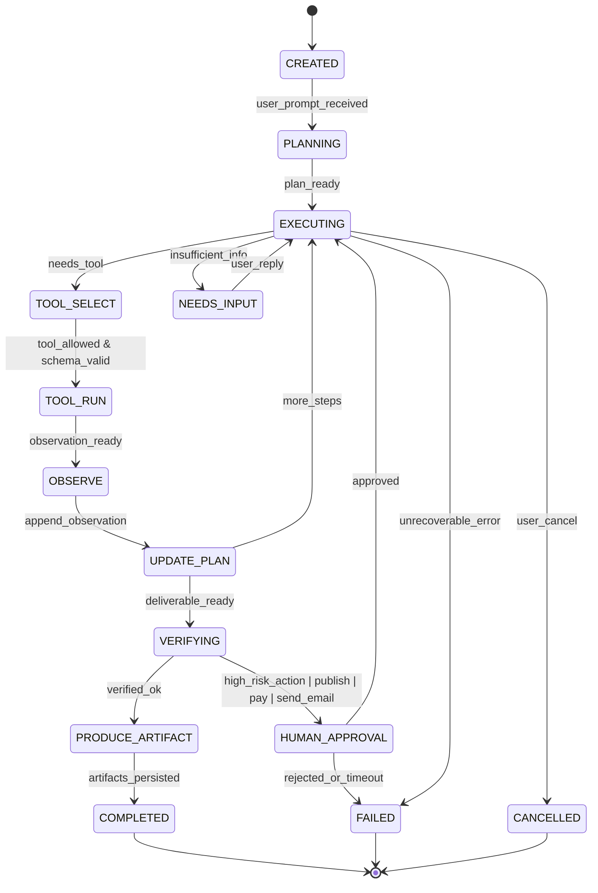

# Reverse‑Engineering Dossier: Manus‑уровневая AI‑agent платформа

## Executive summary

**Что такое Manus (факты).** Manus позиционируется как general‑purpose AI agent, который «не просто отвечает, а выполняет» — разбивает цель на список шагов, работает асинхронно в облаке в собственной «виртуальной машине/компьютере», и возвращает готовые артефакты (слайды, сайты, отчёты, таблицы, результаты в интеграции и т. п.). Это явно следует из официальных описаний продукта, документации по функциям, а также из листинга мобильного приложения, где говорится о выполнении задач в облаке, разбиении на to‑do и уведомлениях по завершению. citeturn4search14turn15view2turn14search17

**Ключевое отличие от чат‑ботов (факты).** В ядре UX у Manus — **задача (task)** как долгоживущий объект с прогрессом, планом и артефактами; вокруг этого построены: Scheduled Tasks (периодические запуски), Projects (персистентные рабочие пространства с «master instruction» и knowledge base), Collab (совместная работа), Browser Operator / Cloud Browser (браузерная/компьютерная агентность), интеграции (Slack, MCP‑коннекторы), и API с асинхронным жизненным циклом и вебхуками прогресса. citeturn7view0turn7view2turn7view3turn3view1turn17view3turn9view0turn10search10

**Сильнейшие differentiators Manus (факты + выводы).**
- **Wide Research**: «параллельная multi‑agent система», где сотни независимых агентов выполняют подзадачи параллельно, чтобы избежать деградации качества из‑за контекстного окна. citeturn6search18  
- **Browser Operator (локальный)** + **Cloud Browser (облачный)**: локальный расширение‑оператор использует ваши активные сессии/логины, снижая CAPTCHA/фрикцию; облачный браузер — изолированная среда для «общих» веб‑задач. citeturn3view1turn17view3  
- **Website Builder как full‑stack**: не только фронтенд, но «backend + database + file storage + deployment», плюс code export/контроль и GitHub sync; база для веб‑проектов в документации явно указана как **managed MySQL** с визуальным браузером данных. citeturn3view4turn9view6turn3view3turn3view2  
- **MCP (Model Context Protocol) как слой интеграций**: Manus поддерживает MCP‑коннекторы и кастомные MCP‑серверы как «мост» к внутренним системам. citeturn17view0turn17view1  
- **Открытые стандарты для “skills”**: Manus заявляет интеграцию Agent Skills open standard. citeturn18search1turn19view0

**Наиболее вероятный класс architecture (обоснованные гипотезы, с опорой на публичные тексты).**
- **Planner → Executor → Verifier цикл** с *контекстно‑зависимой машиной состояний* и *ограничением tool‑пространства* не через удаление tool‑схем, а через **masking/constraint decoding**. Это прямо описано в инженерном посте Manus про context engineering: «state machine», «mask the token logits», стабильный prefix ради KV‑cache, и группировка tool‑префиксами (browser_*, shell_*). citeturn21view0  
- **Внешняя память через файловую систему sandbox**: Manus описывает «file system as the ultimate context» и практику todo.md как механизм удержания внимания в длинных задачах. citeturn21view0  
- **Событийная (event‑driven) модель задач** для UI/API: это следует из Manus API, где есть статусы задачи, polling, вебхуки task_progress/task_stopped. citeturn9view1turn10search10turn10search0

**Приоритетные официальные/публичные источники о Manus (для постоянной валидации; отсортировано по “signal density”).**

| Источник | Что даёт для reverse engineering | Почему приоритет |
|---|---|---|
| Инженерный пост «Context Engineering…» | KV‑cache стратегия, tool‑state machine + logit masking, file‑system memory, todo.md recitation, отказ от “dynamic tool lists” | Это единственный публичный текст с конкретными архитектурными решениями ядра агента citeturn21view0 |
| Документация Features (Wide Research, Browser Operator, Projects, Scheduled Tasks, Mail Manus, Collab, Multimedia) | Канонический перечень capabilities и ключевые UX‑контракты (авторизация, логи, приватность, ограничения) | Максимум фактов о продуктовой поверхности citeturn6search18turn3view1turn7view2turn7view0turn7view1turn7view3turn7view4 |
| Документация Website Builder (Cloud Infrastructure, Payments, Access Control, SEO, Analytics, Code Control, GitHub Integration) | Самое редкое: «full‑stack builder», MySQL, Stripe sandbox workflow, SEO prerendering, RBAC, экспорт кода, двусторонняя синхронизация с GitHub | Это “Manus‑уровень” как продукт, не просто агент в чате citeturn3view4turn9view6turn9view4turn9view3turn9view5turn3view3turn3view2 |
| Manus API (Tasks/Files/Projects/Webhooks, OpenAI SDK compatibility) | Внешний контракт для task lifecycle, статусы, webhooks task_progress, presigned uploads | Позволяет «снять» модель внутреннего runtime через публичный интерфейс citeturn10search3turn9view1turn10search10turn10search4turn10search0turn9view0 |
| Интеграции (MCP Connectors, Custom MCP Servers, Slack) | Как они строят “orchestration layer” между инструментами, и модель совместной работы в Slack | Сильный сигнал об enterprise‑ориентации и масштабируемости интеграций citeturn17view0turn17view1turn17view2 |
| Help Center (pricing/credits, SSO) + Team plan landing | Монетизация (credits), лимиты задач, SSO через WorkOS, SOC2 заявления, opt‑out training | Важный слой packaging и enterprise controls citeturn14search2turn14search6turn4search1turn15view1 |
| Google Play listing | Подтверждает асинхронность, “own computer”, high‑level capability claims и дату обновления | Полезно для проверки официального positioning и таймлайна citeturn15view2 |

---

## Полная карта возможностей Manus

Ниже — **capability map** в формате: *что умеет* → *как выглядит* → *тех. основание (факт/гипотеза)* → *edge cases для аналога*. Важное правило в этой матрице: где Manus не раскрывает детали, я разделяю **факты** и **обоснованные гипотезы**.

| Capability bucket | Пользовательский опыт | Техническая реализация (факт/гипотеза) + уровень уверенности | Edge cases при реализации аналога |
|---|---|---|---|
| Task‑centric агентность (долгие задачи) | Создаёте задачу; агент работает асинхронно; состояние меняется; результат приходит как артефакты/сообщения | Факт: в API есть task lifecycle, статусы и асинхронные паттерны; есть вебхуки task_progress/task_stopped. citeturn10search0turn9view1turn10search10 | Дедупликация повторных запусков; идемпотентность tool‑вызовов; “resume after crash”; гарантии доставки прогресса |
| Planner → Executor → Verifier (ядро агента) | Видимый прогресс (план/шаги), агент корректируется | Факт: Manus описывает agent loop и state machine для tools + error‑as‑context, todo.md recitation. citeturn21view0 | Переобучение «на ошибках» без утечек приватных данных; стоп‑критерии; борьба с бесконечными циклами |
| Wide Research (параллельные агенты) | «Обработай 250 объектов» без деградации качества; выдаёт таблицы/датасет/отчёт | Факт: Wide Research деплоит сотни независимых агентов параллельно + центральная сборка результатов. citeturn6search18 | SLA на тысячи подзадач; ограничение бюджета; контроль качества и консенсус; борьба с источниковой “дырявостью” |
| Projects (персистентные рабочие пространства) | Master instruction + knowledge base файлов; новые задачи «наследуют» контекст | Факт: Projects описаны как persistent workspace; приватность: коллега видит только свои задачи в проекте, если не шарить явно; семантика обновления инструкций/файлов различная. citeturn7view2 | Версионирование project config; конфликт инструкций vs навыков; синхронизация knowledge base; RBAC на проект/задачи |
| Skills (переиспользуемые workflows) | Сохраняете удачный workflow и переиспользуете; композиция | Факт: Skills подчёркивают reusability/composability. citeturn6search15 + Факт: Manus заявляет интеграцию Agent Skills open standard. citeturn18search1turn19view0 | Governance навыков (подпись, ревью); безопасный запуск скриптов; конфликты между skills; обновления без поломки |
| Integrations (Slack) | @manus в треде; агент читает контекст треда; все видят прогресс; совместная итерация | Факт: Slack интеграция описывает модель thread‑based collaboration и “Open Web App” approval для новых участников. citeturn17view2 | Mapping Slack thread → agent run; контроль кредитов и владельца; защита от утечек из треда; rate limits Slack |
| Mail Manus (email‑интерфейс) | У вас уникальный bot‑email; форвардите/CC; получаете результаты обратно; есть workflow‑emails | Факт: уникальный адрес; approved senders; workflow emails + фильтры; cancel через email/приложение; статусы по email. citeturn7view1 | Спуфинг/DMARC; вложения и вирус‑скан; латентность; “случайно форварднул секреты”; дедупликация цепочек |
| Scheduled Tasks | «Каждый будний день в 7:00»; история запусков; нотификации при ошибках | Факт: Scheduled Tasks описывает schedule options, outputs и управление, timezone. citeturn7view0 | Drift таймзон; повтор при ошибке; «не Continuous monitoring» — нужно объяснить; бюджет на регулярки |
| Browser Operator (локальный) | Расширение; агент действует в выделенной вкладке; вы даёте разовый доступ; можно остановить закрытием таба | Факт: расширение + обязательная авторизация + action logging + stop by closing tab; «не хранит пароли». citeturn3view1turn17view3 | Уязвимости расширений; защита от prompt injection на страницах; unsafe downloads; “двойные клики/покупки”; MFA |
| Cloud Browser (облачный) | Изолированная браузер‑сессия для общих задач | Факт: Browser Operator doc сопоставляет cloud vs local; cloud описан как isolated/sandboxed. citeturn3view1turn17view3 | Multi‑tenant изоляция; антибот/капча; безопасность cookies; логин‑state перенос |
| Сессии логинов в cloud browser | «Логин один раз, потом агент может возвращаться» | Публичное описание механики session capture + двойное шифрование + инъекция сессии в sandbox описано в разборе Logto. (Это не официальный Manus текст, но детально и правдоподобно.) citeturn4search13 | Хранение cookie/localStorage как секретов; ротация; выход из аккаунта; юридические риски |
| Артефакты: Slides | «Сделай презентацию» — с исследованиями, дизайном, спикер‑нотами; можно загрузить свой .pptx‑template | Факт: Slides генерируют deck + visuals + speaker notes; поддержка template upload. citeturn8search0 | Гарантии брендинга и layout; конвертация pptx в web preview; корректность графиков; источники для claim’ов |
| Артефакты: Data Analysis & Visualization | Загружаете CSV/Excel; описываете анализ; выбираете формат: slides/dashboard/report/webpage | Факт: описаны входы (CSV/Excel), outputs и форматы. citeturn8search3 | Доверие к данным; воспроизводимость; большие файлы; приватность; «статичные датасеты» vs мониторинг |
| Артефакты: Multimedia | Генерация/понимание изображений, видео‑анализ, voice output, STT, видео‑генерация | Факт: multimedia capabilities и форматы описаны. citeturn7view4 | Модерация контента; большие видео; стоимость; авторские права |
| Design View (интерактивный дизайн) | “Mark tool” — точечно правите части изображения; есть mobile‑editing | Факт: описан workflow, mobile, и что модель — «Google Nano Banana Pro». citeturn7view5turn16search26 | Безопасность “in‑context edits”; хранение исходников; контроль стиля; ограничения модели |
| Website Builder: Cloud Infrastructure | «Полный веб‑проект» = backend+DB+storage+deploy; не надо AWS/Vercel/Netlify | Факт: документация описывает managed backend, DB, file storage, one‑command deployment. citeturn3view4 | Мульти‑tenant backend для generated apps; лимиты ресурсов; миграции; наблюдаемость у пользовательских apps |
| Website Builder: Database | «Интегрированная база» для профилей/каталогов/блогов | Факт: для web‑проектов указан fully managed MySQL + visual interface. citeturn9view6 | Schema migrations; индексы; RLS/ACL; SQL injection; бэкапы |
| Website Builder: Access Control | «Добавь логин/регистрацию» + роли + ограничения на /admin | Факт: built‑in login + role‑based permissions. citeturn9view3 | Пароли/хэширование; email verification; session management; RBAC vs ABAC; аудит |
| Website Builder: Payments | «Build first, sign up later» — Stripe claimable sandbox без первоначального signup | Факт: описан claimable sandbox workflow. citeturn9view4 | Любые платежи требуют строгих human approvals; webhooks; fraud; PCI scope; тест/прод разграничение |
| Website Builder: SEO | Toggle SEO; prerendered HTML для ботов; robots/sitemap/canonical; AI‑оптимизация метаданных | Факт: prerendering, SEO dashboard/scoring, AI Optimize; также указано отсутствие “Private Publish”. citeturn9view5 | Cloaking риски; фантом‑страницы; приватность страниц; индексирование до готовности |
| Website Builder: Code Control | Копировать куски или скачать весь codebase; «no lock‑in» | Факт: copy + download full codebase. citeturn3view3 | Лицензии зависимостей; секреты в коде; различие dev/prod env; переносимость |
| Website Builder: GitHub Integration | Экспорт в приватный repo + двусторонний sync; авто pull before changes; issues/PR/projects | Факт: описан two‑way sync и GitHub connector capabilities. citeturn3view2 | Конфликты мерджа; политики доступа GitHub App; секреты/токены; RBAC на репо |
| Analytics (для web projects) | Встроенные метрики visitors/page views/sources/users + визуальный браузер DB | Факт: built‑in tracking + описанные метрики. citeturn9view6 | Privacy/consent; GDPR; точность атрибуции; хранение сырых логов |
| MCP Connectors | Подключаете Gmail/Notion/Stripe/HubSpot/GitHub и пр.; агент читает/пишет/выполняет действия; multi‑app workflow | Факт: MCP connectors, OAuth2, список категорий и примеры. citeturn17view0 | Scope minimization; anti‑abuse; rate limits; транзакционность (частичный успех) |
| Custom MCP Servers | Подключаете собственные системы через MCP server; инструкция по деплою/подключению; security best practices | Факт: документ с архитектурой, шагами подключения и security considerations. citeturn17view1 | Подпись запросов; zero‑trust; частные сети; мониторинг; версионирование tool schemas |

image_group{"layout":"carousel","aspect_ratio":"16:9","query":["Manus AI agent interface task progress screenshots","Manus Wide Research UI screenshot","Manus Browser Operator Chrome extension screenshot","Manus website builder dashboard MySQL database UI screenshot"],"num_per_query":1}

---

## UX/UI reverse engineering и продуктовые контракты

**Наблюдаемые UX‑принципы Manus (факты, где подтверждается документацией/официальными страницами, и обоснованные гипотезы там, где нужны реконструкции).**

**Онбординг и “entry points” (факты).** На главной странице Manus явно подталкивает к крупным задачам («Create slides / Build website / Develop apps / Design»), что является важным сигналом: продукт оптимизируется под **артефакты и end‑to‑end deliverables**, а не под Q&A. citeturn4search14

**Прогресс долгих задач (факты + гипотезы).**
- Факт: API и вебхуки явно описывают процесс как последовательность обновлений статуса (task_progress), что обычно соответствует UI‑прогрессу/плану. citeturn10search10turn9view1  
- Факт: в инженерном посте Manus описывает практику todo.md как инструмент удержания внимания (и фактически — как UI/UX‑артефакт прогресса). citeturn21view0  
- Гипотеза (high): UI показывает «план/шаги + текущие действия + артефакты + файлы», потому что продукт системно строится вокруг deliverables (Slides/Web apps) и вокруг файловой системы sandbox как внешней памяти. Основание — их design: “file system as context”, плюс документы/экспорт кода/файлов. citeturn21view0turn3view3turn7view4

**Модель совместной работы (факты).**
- Collab: prompts обрабатываются последовательно; владелец контролирует приглашения; collab работает с web dev, slides, research и т. д. citeturn7view3  
- Projects: приглашённые в проект видят master instruction + knowledge base, но **не видят чужие задачи**, пока их явно не поделятся. Это критический продуктовый контракт приватности. citeturn7view2  
- Slack: тред‑коллаборация “по умолчанию” для участников треда, плюс отдельный approval‑flow при присоединении новых людей после старта. citeturn17view2

**UX браузерной агентности (факты).**
- Browser Operator просит разрешение “на каждую сессию”, работает в выделенной вкладке/группе вкладок, можно мгновенно остановить закрытием таба, и «все действия логируются». citeturn3view1turn17view3  
- Local vs Cloud — чёткая продуктовая граница: локальный нужен для authenticated/premium tools; cloud — для “general web tasks”. citeturn3view1turn17view3

**UX интеграций и автоматизации (факты).**
- Scheduled Tasks: UI‑контракт «проверь вручную перед расписанием», «настрой output (email/slack/drive)», «есть history и errors». citeturn7view0  
- Mail Manus: approved senders, confirmation перед сложными задачами (в FAQ), workflow‑emails как отдельные адреса с default prompt’ами. citeturn7view1  
- MCP Connectors: подключение через OAuth2 и “упоминание инструмента в промпте”. citeturn17view0

**UX full‑stack builder (факты).**
- “Backend + database + storage + deployment” под одним продуктовым зонтиком. citeturn3view4  
- Наличие встроенного MySQL и визуального DB‑browser — важный UX‑компонент для нефулстек‑пользователей. citeturn9view6  
- Payments: “build first, sign up later” через Stripe claimable sandbox. citeturn9view4  
- Code transparency: экспорт кода/скачивание базы проекта; GitHub sync. citeturn3view3turn3view2

---

## Архитектурный blueprint аналога Manus

Ниже — инженерный blueprint, который можно реально положить в основу разработки. Если какие‑то детали Manus не раскрывает, я отмечаю это явно как предположение.

### Целевая архитектура (high‑confidence best practice, согласованная с публичными сигналами Manus)

```mermaid
flowchart LR
  U[User: Web/Mobile/Slack/Email] --> FE[Web UI (Tasks, Plan, Artifacts)]
  U --> SL[Slack Bot]
  U --> EM[Mail Ingest]
  FE <--> API[API Gateway / BFF]
  SL --> API
  EM --> API

  API --> AUTH[Auth & Workspace/RBAC]
  API --> TASKS[Task Service]
  TASKS --> ORCH[Agent Orchestrator\n(State machine + planner/executor/verifier)]
  ORCH --> Q[Queue / Durable workflow\n(Temporal/Redis/SQS)]
  Q --> WRK[Workers: tool execution]

  WRK --> LLM[LLM Router\n(OpenAI/Anthropic/OSS)]
  WRK --> SANDBOX[Sandbox Fleet\n(code + file system memory)]
  WRK --> BROWSER[Browser Fleet\n(Cloud browser)]
  WRK --> LOCALB[Browser Operator Bridge\n(local extension sessions)]
  WRK --> MCP[MCP Client\n(connectors + custom servers)]
  WRK --> FILES[Object Storage\n(artifacts/files)]
  WRK --> DB[(Relational DB\n(tasks/state/audit/billing))]
  WRK --> VDB[(Vector DB\n(memory/retrieval)]

  ORCH --> OBS[Observability\n(traces/logs/evals)]
  TASKS --> WH[Webhooks / Events]
  WH --> EXT[External systems (customer apps)]
```

**Почему так (основания).**
- Асинхронные task‑runs, polling и вебхуки прогресса напрямую соответствуют Manus API. citeturn10search10turn9view1turn10search0  
- “Sandbox как виртуальный компьютер”, “file system as context”, и необходимость стабильного prompt prefix → вынуждают выделять orchestration + workers + sandbox fleet как первоклассные компоненты. citeturn21view0turn1view1  
- Наличие локального Browser Operator (расширение) требует отдельного “bridge” слоя с сессионной авторизацией и kill‑switch. citeturn17view3turn3view1  
- MCP‑интеграции и custom MCP servers — отдельный слой tools/data plane. citeturn17view0turn17view1turn19view1

### Репозиторная структура (монорепо), ориентированная на Manus‑класс продукта

Минимально жизнеспособная структура для MVP, но без “архитектурной слепоты”:

- `apps/web/` — Next.js UI: Tasks, Projects, Artifacts, Skill editor, Admin/Billing  
- `apps/api/` — API Gateway/BFF (REST + SSE/WebSocket)  
- `apps/worker/` — tool runners, sandbox/browsers, connectors  
- `apps/orchestrator/` — agent runtime (LangGraph/Temporal workflows, state machine)  
- `packages/agent-core/` — prompts, policies, tool schemas, state machine, evaluators  
- `packages/sdk/` — client SDK (OpenAI Responses compatible, как Manus) citeturn9view1  
- `packages/ui-kit/` — компоненты артефактов (markdown, tables, deck preview, file viewer)  
- `infra/` — IaC (Terraform/Pulumi), k8s manifests, migrations, observability  
- `docs/` — product docs + internal runbooks

### Data model (схема сущностей) для Manus‑уровня

Ниже — “ядро” таблиц. Я даю поля, которые критичны для: (1) воспроизводимости; (2) multi‑tenant; (3) audit/security; (4) billing.

| Таблица | Ключевые поля (минимум) | Связи/жизненный цикл |
|---|---|---|
| `users` | `id`, `email`, `created_at`, `status`, `timezone`, `locale` | 1‑ко‑многим с `memberships`, `api_keys`, `tasks` |
| `workspaces` | `id`, `name`, `plan`, `created_at`, `data_training_opt_out` | 1‑ко‑многим с `projects`, `tasks`, `memberships` |
| `memberships` | `user_id`, `workspace_id`, `role` (owner/admin/member), `created_at` | RBAC на уровне workspace |
| `api_keys` | `id`, `workspace_id`, `name`, `hashed_key`, `scopes`, `created_at`, `revoked_at` | Для API как у Manus (API_KEY header) citeturn10search0turn9view1 |
| `projects` | `id`, `workspace_id`, `name`, `master_instruction`, `created_at` | Аналог Manus Projects citeturn7view2turn10search5 |
| `project_kb_files` | `project_id`, `file_id`, `mode` (read_only/indexed), `added_at` | Knowledge base как “external memory” |
| `tasks` | `id`, `workspace_id`, `project_id?`, `title`, `instructions`, `status`, `mode` (chat/adaptive/agent), `created_at`, `updated_at`, `error` | Статусы как в Manus API: pending/running/completed/failed citeturn9view0turn10search0turn9view1 |
| `task_runs` | `id`, `task_id`, `agent_profile`, `started_at`, `stopped_at`, `final_status`, `credit_usage`, `model`, `metadata_json` | Повторы, ретраи, “resume” |
| `steps` | `id`, `task_run_id`, `idx`, `state`, `plan_json`, `summary`, `started_at`, `ended_at` | План/шаги UI + воспроизводимость |
| `tool_calls` | `id`, `step_id`, `tool_name`, `input_json`, `output_json`, `status`, `duration_ms`, `sandbox_id?`, `browser_session_id?`, `error` | Полный audit trail tools |
| `artifacts` | `id`, `task_id`, `type` (report/site/slides/code/data), `title`, `storage_url`, `mime`, `created_at`, `version` | Отдельно от чата |
| `files` | `id`, `workspace_id`, `filename`, `mime`, `size`, `status` (pending/uploaded/deleted), `created_at` | Manus API uses presigned upload URL pattern citeturn10search4turn10search9 |
| `file_versions` | `file_id`, `storage_url`, `sha256`, `created_at` | Для immutable артефактов |
| `browser_sessions` | `id`, `workspace_id`, `type` (cloud/local), `status`, `created_at`, `expires_at`, `audit_log_url` | Cloud/local separation citeturn3view1turn17view3 |
| `mcp_servers` | `id`, `workspace_id`, `name`, `url`, `auth_type`, `created_at`, `last_healthcheck` | Custom MCP servers citeturn17view1 |
| `connector_accounts` | `id`, `workspace_id`, `provider`, `oauth_scopes`, `created_at`, `revoked_at` | MCP connectors via OAuth2 citeturn17view0 |
| `skills` | `id`, `workspace_id`, `name`, `description`, `visibility`, `created_at` | Agent Skills / SKILL.md пакеты citeturn19view0turn18search5 |
| `skill_versions` | `skill_id`, `version`, `storage_url`, `checksum`, `created_at`, `signed_by?` | Governance и supply‑chain |
| `memory_entries` | `id`, `workspace_id`, `scope` (user/task/project), `text`, `vector_ref`, `ttl`, `created_at` | Гибрид relational + vector |
| `audit_events` | `id`, `workspace_id`, `actor_id`, `action`, `target_type`, `target_id`, `ip`, `ua`, `created_at`, `metadata` | Enterprise trust and forensics |
| `usage_events` | `id`, `workspace_id`, `task_id`, `tokens_in/out`, `model_cost`, `credits`, `created_at` | Credits‑модель как у Manus citeturn14search6turn14search2 |
| `subscriptions` | `id`, `workspace_id`, `provider` (Stripe), `status`, `plan`, `renew_at` | Billing/Team plan citeturn15view1turn9view4 |

### API routes (BFF + public API), вдохновлённые публичным Manus API

**Цель** — сделать ваш аналог совместимым с “long‑running task” паттерном (и, при желании, с OpenAI Responses‑стилем, как заявляет Manus). citeturn9view1turn10search3

| Route | Метод | Назначение | Примечания |
|---|---:|---|---|
| `/v1/tasks` | POST | Создать задачу (prompt, mode, agent_profile, attachments, connectors, project_id) | Manus поддерживает `taskMode` chat/adaptive/agent, `interactiveMode`, `createShareableLink`. citeturn10search0 |
| `/v1/tasks` | GET | Листинг задач с фильтрами/пагинацией | Фильтры по статусу, query, created range, project_id. citeturn9view0 |
| `/v1/tasks/{id}` | GET | Детали задачи + output/артефакты | Есть `convert` для pptx в output (Manus). citeturn10search8turn8search7 |
| `/v1/tasks/{id}` | PUT | Обновить задачу (например, отмена/переинструктаж) | Держите идемпотентность |
| `/v1/tasks/{id}` | DELETE | Удалить/скрыть задачу | `hideInTaskList` идея есть в Manus create task. citeturn10search0 |
| `/v1/projects` | POST/GET | Projects как “контекстные контейнеры” | Manus: default instruction на project. citeturn10search5turn10search2 |
| `/v1/files` | POST | Создать file record + presigned upload URL | Manus: presigned S3 upload_url. citeturn10search4 |
| `/v1/files` | GET | Листинг файлов | 10 последних в Manus пример. citeturn10search7 |
| `/v1/webhooks` | POST/DELETE | Подписки на события | Manus: task_created/task_progress/task_stopped. citeturn10search10 |
| `/v1/stream/tasks/{id}` | SSE/WS | Стрим прогресса для UI | Аналог task_progress без polling |

### Машина состояний агента (production‑grade) с режимами и переходами

Это не копия “внутренностей Manus”, а **реализация того класса**, который следует из их публичного описания: state machine + tool gating + устойчивость к ошибкам. citeturn21view0turn10search10



**Ключевые режимы (совместимые с Manus API).**
- `chat`: без tool‑агентности по умолчанию (или сильно ограничено).  
- `agent`: полный planner/executor loop.  
- `adaptive`: динамический переход chat→agent при триггерах сложности/инструментов.  
Факт существования этих режимов — в Manus Create Task. citeturn10search0

### Tool definitions (контракты инструментов) для аналога Manus

В таблице — «минимальный набор tool‑категорий Manus‑класса», с жёсткими guardrails (это важно для безопасности и для “reliability moat”).

| Tool | Input | Output | Где исполняется | Safety policy / Guardrails |
|---|---|---|---|---|
| `web.search` | `query`, `recency`, `domains?` | `results[]` | Worker (без sandbox) | Запрет на PII scraping; anti‑prompt‑injection фильтр; обязательные citations в research‑режиме |
| `browser.open_url` | `url` | `page_id`, `screenshot?`, `dom?` | Cloud browser | Allowlist/denylist доменов; детектор login/payments; запись видео/логов |
| `browser.click/type/scroll` | `page_id`, `selector`/`coords`, `text?` | `observation` | Cloud/local browser | Для local — требовать user authorization per session и kill‑switch (закрытие таба) как в Manus. citeturn3view1turn17view3 |
| `sandbox.exec` | `language`, `code`, `files[]`, `timeout` | `stdout/stderr`, `artifacts` | Sandbox fleet | Resource quotas, network egress ограничен; запрет на доступ к workspace secrets; запись команд |
| `files.upload/get` | file bytes/ids | `file_id`, `url` | Object storage | Presigned upload pattern как у Manus API. citeturn10search4turn10search9 |
| `db.query` | SQL/DSL | rows | Internal DB proxy | Только scoped queries (workspace_id); ORM/parameter binding; audit |
| `mcp.call` | `server`, `tool`, `args` | `result` | MCP client | OAuth scopes; per‑tool approvals; timeouts; logging (как рекомендует Manus для MCP servers). citeturn17view1turn17view0 |
| `notify.email/slack` | payload | sent/failed | Integration worker | Human approval для внешней отправки; rate limits; шаблоны |
| `deploy.publish_site` | config | url + status | Deployment service | Human approval; secrets scanning; rollback |

### CI/CD и deploy flow (MVP → production)

**MVP‑вариант (1–3 человека).**
- GitHub Actions: lint/test → build Docker images → migrate DB → deploy (например, single‑region Kubernetes или managed PaaS).
- Отдельные окружения: `dev` (разработчики), `staging` (демо), `prod`.
- Preview environments на PR для `apps/web` (быстрые UX итерации).

**Production‑вариант (5–10+ человек).**
- Оркестрация задач через durable workflow engine (Temporal/аналог), чтобы переживать рестарты и иметь replay.
- Отдельные кластера/пулы: `api`, `orchestrator`, `workers`, `browser`, `sandbox`.
- Полный OpenTelemetry pipeline + централизованный audit log store.

---

## Open‑source экосистема по слоям и что изучать

Ниже — **практическая карта**, какие открытые проекты закрывают каждый слой Manus‑класса. Из‑за ограничений объёма я даю: (a) топ‑кандидаты с быстрыми сравнениями; (b) расширенный список “что изучить” репозиторными slug’ами.

### Критически важные стандарты, которые Manus уже использует публично

| Компонент | Repo / стандарт | Stars (ориентир) | Лицензия | Почему это важно для аналога Manus |
|---|---|---:|---|---|
| Model Context Protocol | `modelcontextprotocol/modelcontextprotocol` | ~7.5k citeturn20view1 | MIT citeturn20view3 | Это современный “tool/data plane” для агентов, и Manus строит коннекторы вокруг MCP. citeturn17view0turn17view1turn16search3 |
| MCP reference servers + registry pointers | `modelcontextprotocol/servers` | (очень большой каталог) citeturn19view2 | см. репо | Даёт примеры реализаций MCP tools/resources/prompts, но прямо помечено как reference, не prod‑ready. citeturn19view2 |
| Agent Skills open standard | `agentskills/agentskills` | ~13.3k citeturn20view0 | Apache‑2.0 (код) citeturn20view2 | Manus официально заявляет интеграцию этого стандарта — значит, ваш аналог должен уметь: discovery → selective load → execution. citeturn18search1turn19view0 |
| Чужие “production‑grade” skills примеры | `anthropics/skills` | ~94.6k citeturn19view3 | mixed (часть Apache 2.0, часть source‑available) citeturn19view3 | Это кладезь паттернов: документ‑пайплайны, skill packaging, governance. citeturn19view3 |

### Сравнение топ‑проектов по слоям (то, что реально даст “Manus‑уровень”)

| Слой | Top проекты (repo slug) | Maturity/fit | Pros | Cons/risks |
|---|---|---|---|---|
| Agent orchestration (stateful) | `langchain-ai/langgraph` citeturn22search0turn22search32 | High | Stateful граф‑агенты, удобно выражать state machine и долгие runs | Нужно дисциплинированно проектировать state; observability “своими руками” |
| Coding agents / SWE runtime | `OpenHands/OpenHands` citeturn22search1 | High‑ish | Открытая реализация “AI‑dev agent”, много готовых паттернов | Есть ограничения лицензирования в отдельных компонентах (например, `OpenHands-Cloud` не OS) citeturn22search9 |
| Browser automation | `microsoft/playwright` citeturn22search2turn22search34 | Very high | Надёжность, кросс‑браузерность, огромная экосистема | Для “agentic” нужно добавить слой устойчивости (DOM drift, retries, heuristics) |
| Secure sandboxes (code/desktop) | `e2b-dev/E2B` citeturn22search3turn22search39 | High | Специализация на isolated sandboxes для AI; есть infra репо citeturn22search11 | Для enterprise потребуется строгая сеть/секреты/изоляция; стоимость |
| Skills & tool ecosystem | MCP + Agent Skills (см. выше) | High | Стандартизирует интеграции и “процедурную экспертизу” | Supply‑chain риск skills marketplace (нужна модерация и подпись) |
| Website/app builder backend | (Нет “одного” OS проекта уровня Manus) | Medium | Реально строится как продукт: templates + orchestrated codegen + deploy | Самый дорогой слой: безопасность, хостинг, БД, миграции |
| Observability (LLM/agent) | (рекомендуется Langfuse‑класс) | Medium‑High | Трейсы/промпты/сравнение runs | Нужно фильтровать PII и секреты, иначе утечки через логи |
| Storage/auth/workspaces | (Supabase/Keycloak‑класс) | High | Быстрый старт: auth + RLS + storage | Мульти‑tenant и RBAC должны быть спроектированы заранее |

### 20+ дополнительных agent‑проектов, которые стоит изучить (репозиторные slug’и)

Ниже — **список направлений**, которые покрывают разные “механики” (tool use, SWE‑агенты, multi‑agent, browser/computer use, evals). Лицензии и актуальные метрики нужно проверить перед внедрением в продукт (это обязательная практика supply‑chain).

**Фреймворки/агентные SDK:**  
`microsoft/autogen` • `crewAIInc/crewAI` • `langchain-ai/langchain` citeturn22search8 • `run-llama/llama_index` • `pydantic/pydantic-ai` • `openai/openai-agents-python` (MCP интеграции описаны) citeturn16search34

**SWE/кодинг агенты:**  
`princeton-nlp/SWE-agent` • `aider-AI/aider` • `continuedev/continue` • `All-Hands-AI/openhands-github-action` citeturn22search17

**Computer use / sandboxed desktop:**  
`e2b-dev/open-computer-use` citeturn22search19 • (изучать также подходы на базе VNC/streaming)

**RAG/векторные БД (для memory):**  
`chroma-core/chroma` • `weaviate/weaviate` • `qdrant/qdrant` • `milvus-io/milvus`

**Workflow engines (durable long jobs):**  
`temporalio/temporal` • `prefecthq/prefect` • `dagster-io/dagster` • `apache/airflow`

**Observability:**  
`open-telemetry/opentelemetry-collector` • `prometheus/prometheus` • `grafana/grafana` • `getsentry/sentry` • `Arize-ai/phoenix`

**Model serving:**  
`vllm-project/vllm` (prefix caching обсуждается в контексте Manus) citeturn21view0 • `huggingface/text-generation-inference` • `ggerganov/llama.cpp` • `ollama/ollama`

---

## Security, sandboxing и Human‑in‑the‑loop политики

Это раздел, который **определяет жизнеспособность** “Manus‑класса” продукта: как только агент умеет браузер/код/интеграции, вы фактически выпускаете “оператора”, а значит attack surface резко растёт.

### Подтверждённые safety‑контракты, которые Manus подчёркивает

- **Browser Operator**: пользователь **обязан авторизовать каждую сессию**, может остановить в любой момент, действия логируются; Manus заявляет, что не хранит пароли. citeturn3view1turn17view3  
- **Mail Manus**: только pre‑approved senders могут триггерить задачи (анти‑спуфинг/анти‑абьюз на уровне продукта). citeturn7view1  
- **Team/Business позиционирование**: на Team plan странице есть заявления про SOC2 и “не тренируем на ваших данных”, плюс granular sharing controls. citeturn15view1  
- **SSO**: в help center описана настройка SSO через WorkOS (значит, enterprise auth — часть продукта). citeturn4search1

### Политики, которые должны быть в вашем аналоге (best practice, high)

**Tool permissioning (обязательный слой).**  
Каждый инструмент должен иметь: `risk_level`, `requires_approval`, `data_scopes`, `side_effects`.  
- *Низкий риск*: чтение публичных страниц, локальный анализ данных в sandbox.  
- *Средний риск*: запись в Notion/Google Drive, создание тикетов, коммиты в GitHub.  
- *Высокий риск*: платежи, отправка email наружу, деплой публичного приложения, действия в CRM.

**Human‑in‑the‑loop “gates”.**  
Реализуйте явные checkpoint’ы (см. state machine):  
- перед любым “irreversible action” (покупка, платеж, удаление, публикация, массовая рассылка);  
- при обнаружении “credential boundary” (логин, MFA, paywall);  
- перед использованием локального Browser Operator (строго разовый grant). Это повторяет продуктовый контракт Manus. citeturn17view3turn3view1

**Sandbox hardening.**
- Изоляция per run (микро‑VM/контейнер), CPU/RAM/time quotas.  
- Сеть: по умолчанию egress ограничен; отдельные allowlists.  
- Секреты: sandbox не получает workspace OAuth tokens “в открытую”; только проксируемые вызовы через tool layer.  
- Артефакты: сканирование на секреты (например, случайно сгенерированные ключи) перед публикацией/экспортом.

**Prompt injection defense.**
- Любой внешний контент (web, email, docs) — “untrusted input”; маркируйте как observation, а не system.  
- Не позволяйте веб‑странице менять tool policies (никаких “инструкций” из web в system).  
- Для browser‑агента: отдельный “browser operator prompt” с запретом выполнять финансовые/аккаунтные действия без явного подтверждения.

**Auditability.**
- Полные логи tool_calls (input/output/errors), особенно для browser и MCP. Manus подчёркивает logging в Browser Operator. citeturn3view1turn17view3turn17view1  
- Невозможность “подчистить историю” задним числом (append‑only event store или WORM‑bucket для критичных логов).

---

## Testing, eval‑метрики и observability план

### Наблюдаемость: что логировать (минимальный “Manus‑класс”)

**Событийная модель** должна отражать ход task‑run так, чтобы UI и внешние системы могли восстанавливать картину. Manus API прямо демонстрирует, что “task_progress” — first‑class событие. citeturn10search10

**Логи (структурировано).**
- `task_run_started`, `task_plan_updated`, `step_started/ended`, `tool_call_started/ended`, `artifact_created`, `needs_input`, `human_approval_requested/approved/rejected`, `task_completed/failed`.  
- Для каждого: `workspace_id`, `task_id`, `run_id`, `step_id`, `trace_id`, `cost/credits`, `model`, `tool_name`.

**Трейсинг.**
- OpenTelemetry spans: `orchestrator.plan`, `llm.call`, `tool.browser`, `tool.sandbox`, `mcp.call`, `storage.put`.  
- Корреляция: `trace_id` в UI (debug mode) + в webhooks payload.

**Метрики/дашборды (минимум).**
- Success rate по типам задач (research/slides/webapp/browser).  
- Avg time‑to‑complete, p95 latency.  
- Tool failure rate по tool_name и доменам (browser).  
- Средний “steps per task”, “tool_calls per task” (в Manus упоминается, что agent loop длиннее чата; token ratio ~100:1 — важный cost driver). citeturn21view0  
- Credits usage: Manus использует credits и возвращает credit_usage в API. citeturn9view0turn14search6

### Eval‑подход (MVP → production)

**MVP (первые 30 дней).**
- Golden tasks набор из 30–50 сценариев:  
  - 10 research задач (с citations),  
  - 10 browser задач (логин‑free + 2–3 с человеческим подтверждением),  
  - 10 “артефактных” (slides/report/таблица),  
  - 10 “код/сайт” (scaffold + простая CRUD + auth stub).  
- Метрики: completion rate, human‑intervention count, tool error rate, average retries.

**Production‑grade (после MVP).**
- Сравнения “prompt+policy版本” через A/B runs (одна и та же задача, разные версии orchestrator).  
- Pairwise LLM‑eval для текстовых артефактов + rule‑based проверки для кода (tests/build).  
- Browser eval: replay‑tests (запись действий + повтор).

---

## Roadmap, 30‑дневный MVP backlog, миграция в production, риски и неизвестности

### 30‑дневный MVP backlog (таблица)

Оценки — в **person‑days** (PD) для команды 1–3 человека (без учёта маркетинга). Цель MVP: “Manus‑минимум” — долгие task‑runs + 3 класса tools (sandbox, cloud browser, MCP‑stub) + артефакты (report + простая web‑страница).

| Неделя/милестон | Задача | Deliverable | Оценка |
|---|---|---|---:|
| Week 1: Skeleton | Спроектировать DB schema + миграции | Postgres schema + Prisma/SQL migrations | 2 PD |
|  | Реализовать `POST/GET /v1/tasks` + task state (pending/running/completed/failed) | API как Manus‑класс (асинхронно) | 3 PD |
|  | Orchestrator v0: state machine каркас (Planning→Execute→NeedsInput→Complete) | Рабочий цикл без tools | 3 PD |
|  | UI v0: список задач + экран задачи + SSE стрим статуса | Минимальный tasks UI | 4 PD |
| Week 2: Sandboxes | Интегрировать sandbox runner (код+файлы) | `sandbox.exec` tool + artifacts | 4 PD |
|  | File uploads (presigned URL) + storage | `/v1/files` как Manus‑паттерн | 3 PD |
|  | Basic memory: file‑system + summary | todo.md + summaries | 2 PD |
| Week 3: Browser | Cloud browser runner (Playwright) + screenshot/DOM extraction | `browser.open/click/type` | 5 PD |
|  | Tool reliability: retries, timeouts, idempotency wrappers | Снижение “flaky” | 3 PD |
|  | Artifact panel: report builder (markdown→html/pdf) | Артефакт “Report” | 3 PD |
| Week 4: Integrations + safety | MCP client stub + 1 реальный коннектор (например, Notion/GDrive) | `mcp.call` MVP | 4 PD |
|  | HITL approvals UI (publish/send/commit/pay) | Approval modal + audit | 3 PD |
|  | Webhooks (task_created/task_progress/task_stopped) | External notifications | 3 PD |
|  | Observability v0 (structured logs + traces + dashboards) | Минимальный SRE слой | 4 PD |

### Рекомендованный стек (и альтернативы)

**Стек “1–3 человека” (быстро, прагматично).**
- Frontend: Next.js + React, SSE для прогресса, компонентная библиотека уровня shadcn/ui (по вкусу).  
- Backend: FastAPI (быстро) или Node.js (если сильны в TS).  
- Orchestration: LangGraph‑класс для stateful runs (или простой internal engine на первой итерации). LangGraph позиционируется как orchestration framework для stateful agents. citeturn22search0  
- Browser: Playwright. citeturn22search2turn22search34  
- Sandbox: E2B‑класс (или контейнеры). E2B описывает secure isolated sandboxes для AI code execution. citeturn22search3turn22search39  
- DB: Postgres + S3‑storage.  
- Observability: OpenTelemetry + Sentry.

**Стек “5–10 человек” (масштаб, надежность).**
- Backend: Go (и это совпадает с публичным следом о Golang backend в вакансии‑агрегаторе) citeturn12view1 + отдельный Python оркестратор при необходимости.  
- Workflow engine: Temporal (durable).  
- Отдельные пулы browser/sandbox, строгий zero‑trust.

### Миграция MVP → production (путь без “переписывания с нуля”)

1) **Стабилизировать ядро контекст‑инжиниринга**: стабильный prefix, append‑only traces, state machine, tool gating (как описывает Manus). citeturn21view0  
2) **Ввести “Projects + Knowledge base” как first‑class**: это реальный retention‑механизм и основа для enterprise workflows. citeturn7view2turn6search9  
3) **Вынести tools в стандарты**: MCP для интеграций, Agent Skills для процедурных workflows; Manus явно движется туда. citeturn17view0turn17view1turn18search1turn19view0  
4) **Multi‑tenant + enterprise controls**: SSO/SCIM, audit logs, dataoptout. Manus Team/SSO подтверждает важность. citeturn4search1turn15view1turn13search2  
5) **Reliability moat**: eval pipelines, replay browser runs, safe sandboxes, cost controls (credits/budgets). Manus credits‑модель и лимиты задач дают прямой продуктовый ориентир. citeturn14search6turn14search2turn7view0

### Risk register (таблица)

| Риск | Impact | Likelihood | Mitigation |
|---|---:|---:|---|
| Prompt injection через web/email/docs → опасные tool actions | High | High | Untrusted‑content policy, tool approvals, sandbox isolation, allowlists |
| “Flaky” browser automation ломает доверие | High | High | Playwright + retries + page heuristics + recording/replay + HITL |
| Утечки секретов через логи/трейсы | High | Medium | Redaction pipeline, separate secure vault, least privilege |
| Cost runaway (agents бесконечно шагуют) | High | High | Budgets per run, max tool calls, max wall time, early stop criteria |
| Supply‑chain риск skills/коннекторов | High | Medium | Signed skills, review, permission scopes, quarantine |
| Multi‑tenant data leakage | High | Medium | RLS, tenant‑scoped storage keys, audit queries |
| Юридические риски (scraping, ToS) | Medium‑High | Medium | Policy guardrails, domain rules, user approvals, compliance docs |
| Модельные регрессии (провайдер меняет поведение) | Medium | High | Canary evals, version pinning, fallbacks |

### Unknowns / gaps о Manus (что нельзя подтвердить публично)

1) **Точные prompt templates** (system/planner/verifier/browser) — публично не раскрыты; можно лишь реконструировать паттерны (state machine, todo.md, file‑system memory). citeturn21view0  
2) **Конкретная инфраструктура sandbox/browser fleet** (Firecracker vs containers vs др.) — есть признаки “virtual machines/virtual computers”, но без спецификации. citeturn14search13turn15view2  
3) **Какие LLM‑провайдеры и как маршрутизируются** — в публичных доках не фиксируется как архитектурный факт; требуется hands‑on тестирование.  
4) **Надёжность/внутренние eval benchmarks** — в блогах упоминаются “internal benchmarks” и метрики, но без открытой методологии. citeturn14search0  
5) **Trust Center детали**: страницы trust.manus.im частично недоступны для машинного парсинга, поэтому подтверждения (SOC2 и пр.) доступны лишь через публичные landing/help материалы. citeturn15view1turn4search2

---

## Final deliverables

**One‑page summary (сжато).**  
Manus — task‑centric AI agent платформа, объединяющая: (1) асинхронные задачи с прогрессом; (2) sandbox‑компьютер и файловую систему как внешнюю память; (3) browser/computer use (cloud + local operator) с явной авторизацией и audit logs; (4) параллельную multi‑agent обработку (Wide Research); (5) full‑stack website builder (backend+MySQL+storage+deploy+payments+SEO+analytics) с экспортом кода и GitHub sync; (6) интеграции через MCP и кастомные MCP серверы; (7) skills как переносимые workflow‑пакеты по Agent Skills стандарту; (8) enterprise‑слой (SSO, collab/privacy, pooled credits). citeturn6search18turn21view0turn3view1turn17view3turn3view4turn9view6turn9view4turn3view2turn17view0turn17view1turn18search1turn4search1turn15view1

**Архитектурная схема (текстом).**  
UI/BFF → Task Service → Orchestrator (state machine + planner/executor/verifier) → Durable queue/workflow → Workers (browser, sandbox, MCP) → Storage/DB/VDB → Observability + Webhooks/SSE.

**Таблица “какие модули нужны для аналога Manus” (минимум).**

| Модуль | Зачем | MVP? | Production? |
|---|---|---:|---:|
| Task lifecycle + SSE/Webhooks | основа UX и API | ✅ | ✅ |
| Agent runtime (state machine) | надёжная агентность | ✅ | ✅ |
| Sandbox fleet | код/файлы/внешняя память | ✅ | ✅ |
| Cloud browser | web tasks | ✅ | ✅ |
| Local browser operator | authenticated workflows | ⛔ (опц.) | ✅ |
| Projects + knowledge base | повторяемые SOP | ✅ | ✅ |
| Skills | повторяемость workflows | ⛔ (опц.) | ✅ |
| MCP integration | коннекторы/enterprise | ⛔ (1 конн.) | ✅ |
| Website builder full‑stack | “Manus‑уровень moat” | ⛔ | ✅ |
| Billing/credits | экономическая модель | ✅ (просто) | ✅ (полно) |
| Observability/audit | доверие и отладка | ✅ | ✅ |

**Таблица “чем реализовать каждый модуль” (рекомендации).**
- Orchestrator: LangGraph‑класс (stateful agents). citeturn22search0  
- Browser: Playwright. citeturn22search2turn22search34  
- Sandbox: E2B‑класс. citeturn22search3turn22search39  
- Integrations: MCP (standard) + custom MCP servers. citeturn17view0turn17view1turn20view3  
- Skills: Agent Skills open standard. citeturn19view0turn20view2

**MVP vs Production (ключевые различия).**
- MVP: 1 browser (cloud), 1 sandbox, 1 интеграция, 1 тип артефакта, простые budgets.  
- Production: multi‑tenant isolation, local browser operator, skill marketplace governance, full audit, durable workflows, eval pipelines, multi‑region.

**Copy / adapt / improve (по Manus).**
- Copy: state machine + tool gating подход, file‑system memory, explicit authorization for browser operator, Projects semantics приватности. citeturn21view0turn17view3turn7view2  
- Adapt: Wide Research (начать с 10–50 параллельных subagents, затем масштабировать). citeturn6search18  
- Improve: строгие sandbox политики + skill signing + replay‑based browser debugging (чтобы снизить абьюз и повысить доверие).

**Топ‑20 ключевых инсайтов (самые “несжимаемые”).**
1) Manus оптимизирует не диалог, а **артефакт + выполнение**. citeturn4search14turn15view2  
2) Асинхронность и webhooks — ядро UX/API. citeturn10search10turn9view1  
3) Wide Research — масштабирование через параллельных агентов. citeturn6search18  
4) State machine + logit masking вместо динамической смены tool‑списка. citeturn21view0  
5) KV‑cache hit rate как ключевой production‑метрик. citeturn21view0  
6) File system в sandbox как внешняя память «без лимита». citeturn21view0  
7) todo.md recitation — дешёвый способ удерживать фокус. citeturn21view0  
8) Ошибки не скрывать: “keep the wrong stuff in”. citeturn21view0  
9) Local browser operator даёт authenticated moat и снижает CAPTCHA. citeturn17view3turn3view1  
10) User‑controlled authorization и kill‑switch обязательны. citeturn3view1turn17view3  
11) MCP — унификация интеграций. citeturn17view0turn20view3  
12) Custom MCP servers — мост к enterprise внутренним системам. citeturn17view1  
13) Agent Skills standard — переносимая “процедурная экспертиза”. citeturn19view0turn18search5  
14) Projects — retention через персистентный контекст + knowledge base. citeturn7view2turn6search9  
15) Privacy модель Projects: коллега не видит чужие tasks по умолчанию. citeturn7view2  
16) Full‑stack builder — продуктовый moat (backend+DB+deploy). citeturn3view4turn9view6  
17) Built‑in MySQL + визуальный DB‑browser — UX для “не‑разработчиков”. citeturn9view6  
18) Payments “build first” через Stripe sandbox — убирает фрикцию. citeturn9view4  
19) SEO prerendering — важный “над‑чатом” слой для web products. citeturn9view5  
20) Credits‑экономика — способ контролировать cost и паковать планы. citeturn14search2turn14search6

**Build order на 30/60/90 дней (кратко).**
- 30: task runtime + sandbox + cloud browser + report artifact + 1 connector + approvals.  
- 60: projects/knowledge base + scheduled tasks + webhooks + multi‑agent batch (mini‑Wide Research) + observability v1. citeturn7view2turn7view0turn6search18turn10search10  
- 90: skills standard + MCP full layer + local browser operator + enterprise auth + hardened sandbox fleet.

*(Если вы хотите буквально “повторить Manus”, самый честный путь — строить **класс системы**, а не пытаться угадать невидимые prompt’ы: Manus сам публично показывает, что его конкурентное преимущество — контекст‑инжиниринг, архитектура agent loop, и продуктовые контуры (Projects/Builder/Integrations), а не один “секретный промпт”.)* citeturn21view0turn7view2turn3view4turn17view0